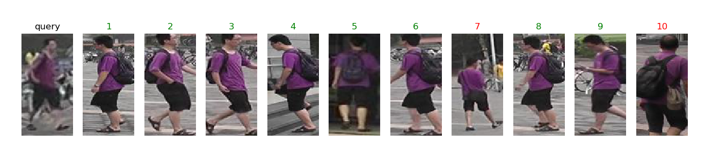
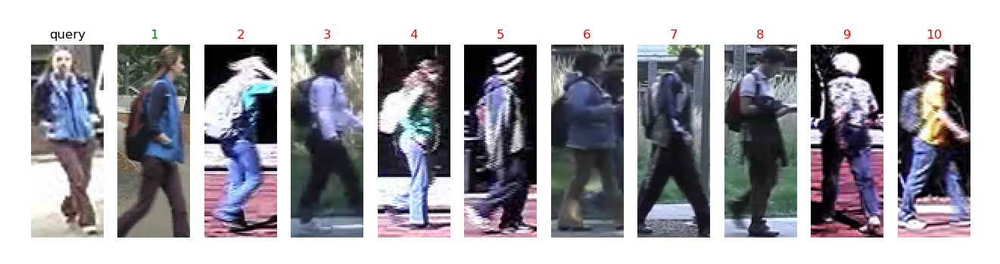

# Week 9

> 这周没看 Unity 的东西，看了点深度学习。这应该是最后一周了，下周就开学了。

我们组的大创题目是 “行人重识别”，这几天看了一个基于 `ResNet` 的简单模型，在百度的机器上训练了一个小时。这个模型是拿行人的 `ID` 也就是标签作为输出，`Market1501` 中的 751 个人就有751个标签，把行人重识别当成了一个分类任务，感觉很奇怪，不过这样确实普适性不高。在训练的这个数据集上 `Rank1` 到了 0.876，`mAP` 达到 0.71，然而在另一个数据集 `VIPeR` 上却低的极惨，这个数据集很小，每个人只有两张照片，但即使是 `Rank10` 也低得可怜，不过还是可也看出网络内部是有一些特征保留的，感觉很神奇。前些天有人在知乎上发了一个根据这个调整过的模型，`Rank1` 达到了 95.81% 甚至 96.25%，`mAP = 88.28%` ，但是没有看懂是怎么调的，还得再看看。

#### Market1501

#### VIPeR

